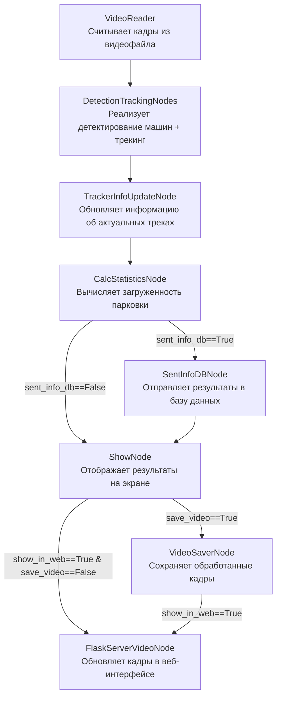

# Free_parking_places_analyser
Free_parking_places_analyser

# Анализ количества свободных мест на парковке

Данная программа осуществляет анализ количество свободных мест на выделенном участке дороги - парковке. Алгоритм определяет сколько есть свободных и занятых мест и выводит интерактивную статистику.

## Установка:
Необходима версия Python >= 3.10 (лучше 3.10.14)
```
pip install torch torchvision torchaudio --index-url https://download.pytorch.org/whl/cu118
pip install -r requirements.txt

## Поднятие сервисов

Для поднятия сервисов Postgres и Grafana понадобится установленный и запущенный Docker decktop

```
## Работа с программой:
Перед запуском необходимо в файле __configs/app_config.yaml__ указать все желаемые параметры. 

Перед запуском кода также необходимо запустить в терминале run_services.bat

Для того, чтобы пользоваться уже готовыми дашбордами Grafana, необходимо сгенерированную папку services заменить на services.zip(разархивировать)

Далее можно запускать код.

Ссылка на визуализацию flack появится в терминале после запуска кода

Ссылку на web-interface Grafana можно кликнуть в Docker decktop (логин admin/password admin)  

Классический запуск кода:
```
python main.py
```
Пример запуска в дебаг режиме (профилировщик):
```
python main.py hydra.job_logging.root.level=DEBUG
```
---

```
Для тестирования работы проекта в репозитории уже имеется видео test_videos/parking1_test.mp4.

Чтобы запустить проект с определенным видео, необходимо указать путь к нему в файле конфигурации configs/app_config.yaml проекта в разделе video_reader.src.

---
Отключить отображение окна со статистикой можно при выборе в конфигурации show_node.show_info_statistics=False <br/>
Чтобы наблюдать fps обработки, необходимо в конфиге указать show_node.draw_fps_info=True.  <br/>При наличии GPU получается достигнуть порядка 30-40 кадров в секунду в случае запуска __main_optimized.py__

## Включение сторонних сервисов для визуализации результатов:
Программа позволяет вести запись актуальной статистики о машинопотоке в базу данных PostgreSQL и тут же осуществлять визуализацию в виде интерактивного дашборда Grafana.


Тем самым у конечного потребителя этого приложения имеется возможность запустить код один раз, подключив на вход RTSP поток или заготовленный видеофайл, и постоянно получать актуальную статистику, а также просматривать историю загруженности парковки.

### Что нужно сделать для запуска кода в таком режиме:
1. Необходимо в файле configs/app_config.yaml в разделе pipeline указать sent_info_db=True.
2. Необходимо установить все сервисы. Для этого нужно поднять компоуз из контейнеров и создать папки, в которые будут прокинуты вольюмы от них. Чтобы это сделать, требуется в терминале запустить написанный bat-файл:
```
run_services.bat
```
Далее нужна заменить папку services как описано выше

3. Как только убедитесь, что все три контейнера поднялись и работают, можно запускать сам код:
```
python main.py 
```
Для доступа в Grafana необходимо перйти на сайт http://localhost:3111/

Пример того, как в реальном времени строятся графики на дашборде после запуска кода:


## Вывод обработанного видеопотока в веб-интерфейс:

Обработанные кадры можно отображать в веб-интерфейсе (вместо отдельного окна OpenCV). Бэкенд сайта реализован с использованием Flask.

Для того, чтобы запустить проект таким образом, необходимо в файле configs/app_config.yaml в разделе pipeline указать show_in_web=True и в show_node указать imshow=False. Далее можно запускать main.py или main_optimized.py и переходить по ссылке http://localhost:8100/


## Рассмотрим, как реализован код:

Каждый кадр последовательно проходит через ноды, и в атрибуты этого объекта постепенно добавляется все больше и больше информации.


